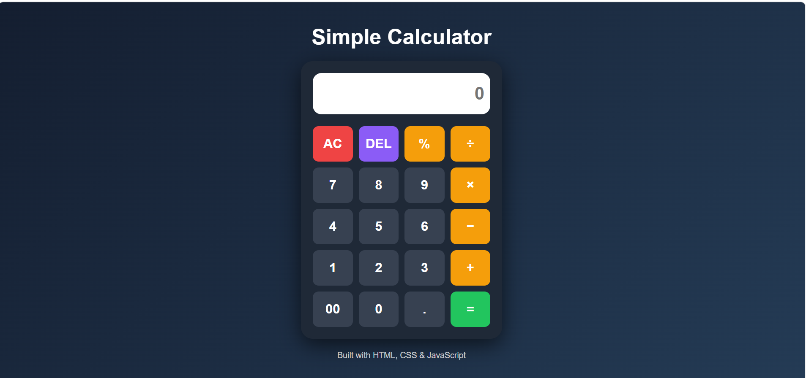

# 🧮 Calculator

A modern and responsive **Calculator** built using **HTML5**, **CSS3**, and **JavaScript**. This project performs basic arithmetic operations with a clean user interface and interactive functionality.

  <a href="https://somasindhuja.github.io/codesoft_tasks/calculator/">
    <strong>🌐 Live Demo</strong>
  </a>

---

# 📸 Project Preview

  

---

# 📖 About the Project

This project is a simple and responsive **Calculator** developed using **HTML5**, **CSS3**, and **JavaScript**. It allows users to perform basic arithmetic operations through an interactive interface while improving fundamental front-end development and JavaScript skills.

---

# ✨ Features

- ➕ Addition
- ➖ Subtraction
- ✖️ Multiplication
- ➗ Division
- 📊 Percentage Calculation
- 🧹 Clear (AC) Function
- ⌫ Delete (DEL) Function
- ⚡ Real-time Calculations
- 🎨 Modern User Interface
- 📱 Responsive Design
- 🖱️ Event Listener-Based Button Actions
- ⚠️ Error Handling for Invalid Expressions

---

# 🛠️ Technologies Used

- **HTML5** – Page Structure
- **CSS3** – Styling and Layout
- **JavaScript (ES6)** – Calculator Logic and DOM Manipulation
- **CSS Grid** – Button Layout

---

# 🎯 Learning Outcomes

Through this project, I improved my skills in:

- Semantic HTML5
- CSS3 Styling
- CSS Grid Layout
- JavaScript DOM Manipulation
- Event Listeners
- Functions
- Conditional Statements (`if...else`)
- Error Handling (`try...catch`)

---

# 🚀 Future Enhancements

- ⌨️ Keyboard Input Support
- 🌙 Dark/Light Mode Toggle
- 📜 Calculation History
- 🧮 Scientific Calculator Functions
- 🎞️ Smooth Button Animations

---

# 👩‍💻 Author

**Sindhuja Soma**

- GitHub: https://github.com/somasindhuja

---

### ⭐ If you found this project useful, consider giving it a Star!

Thank you for visiting my repository.

