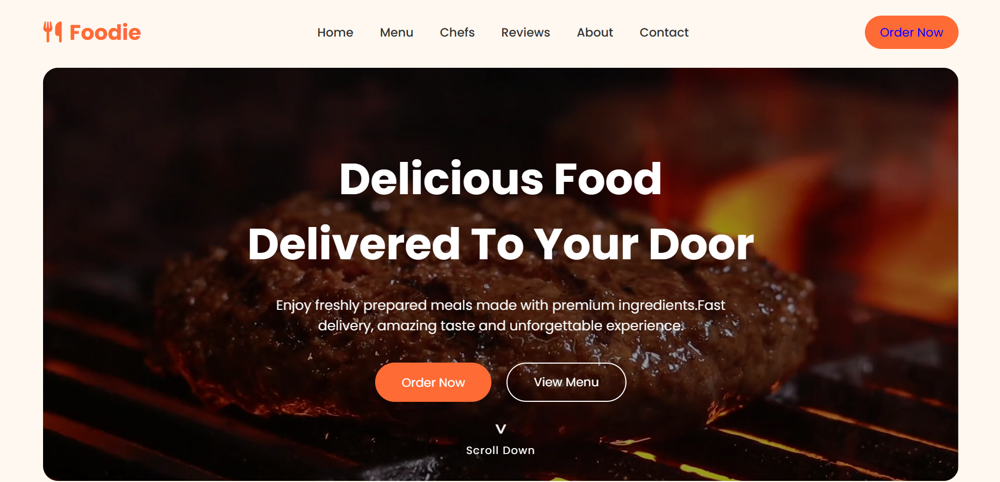

# 🍽️ Restaurant Landing Page

A modern and responsive **Restaurant Landing Page** built using **HTML** and **CSS** as part of the **CodSoft Web Development Internship – Level 1 Task 2**.

---

## 📸 Preview

<p align="center">
  
</p>

---

## 📖 Project Overview

This project is a visually appealing restaurant landing page designed to provide an engaging user experience. It features a modern layout, smooth navigation, attractive sections, and a responsive design that works across different devices.

---

## ✨ Features

- 🎬 Hero Section with Background Video
- 🍽️ About Restaurant
- 📋 Food Menu
- 👨‍🍳 Meet Our Chefs
- ⭐ Customer Testimonials
- 📞 Contact Section
- 📱 Fully Responsive Design
- ✨ Smooth Scrolling Navigation
- 🎨 Modern UI & Hover Effects

---

## 🛠️ Technologies Used

- HTML5
- CSS3

---

## 📂 Folder Structure

```text
landing_page/
│── assets/
│   ├── images/
│   └── videos/
│── index.html
│── style.css
└── README.md
```

---

## 🚀 Live Demo

🔗 https://somasindhuja.github.io/codesoft_tasks/landing_page/

---

## 👩‍💻 Author

**Sindhuja Soma**

- GitHub: https://github.com/somasindhuja
- LinkedIn: https://www.linkedin.com/in/soma-sindhuja-85b07128a/

---

⭐ If you like this project, feel free to give it a ⭐ on GitHub.