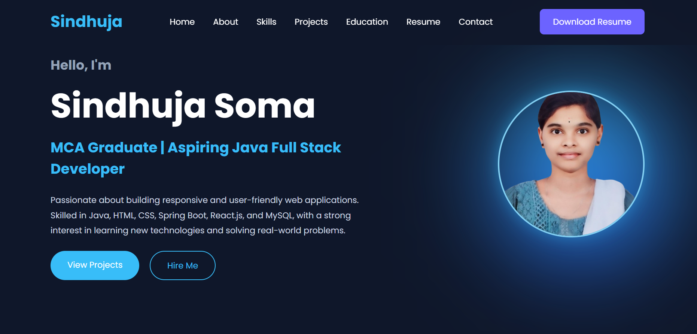

# 💼 Personal Portfolio Website

A modern and responsive **Personal Portfolio Website** built using **HTML** and **CSS** as part of the **CodSoft Web Development Internship – Level 1 Task 1**.

---

## 📸 Preview

<p align="center">
  
</p>

---

## ✨ Features

- 👋 Hero Section
- 🙋 About Me
- 💻 Skills
- 🚀 Projects
- 🎓 Education
- 📄 Resume Download
- 📩 Contact Section
- 📱 Responsive Design
- ✨ Smooth Scrolling

---

## 🛠️ Technologies Used

- HTML5
- CSS3

---

## 📂 Folder Structure

```text
portfolio/
│── assets/
│   └── images/
│── resume/
│── index.html
│── styles.css
└── README.md
```

---

## 🚀 Live Demo

🔗 https://somasindhuja.github.io/codesoft_tasks/portfolio/

---

## 👩‍💻 Author

**Sindhuja Soma**

- GitHub: https://github.com/somasindhuja
- LinkedIn: https://www.linkedin.com/in/soma-sindhuja-85b07128a/

---

⭐ If you like this project, feel free to give it a star!